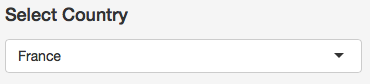
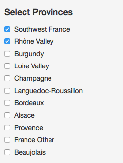
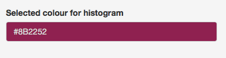
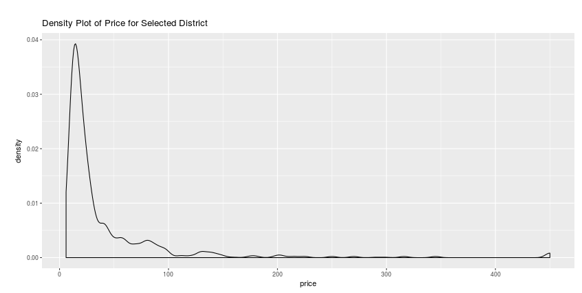
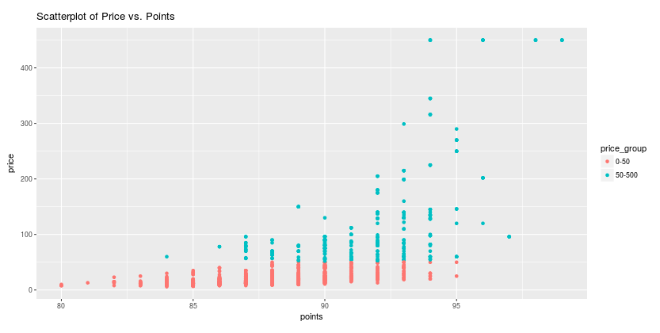
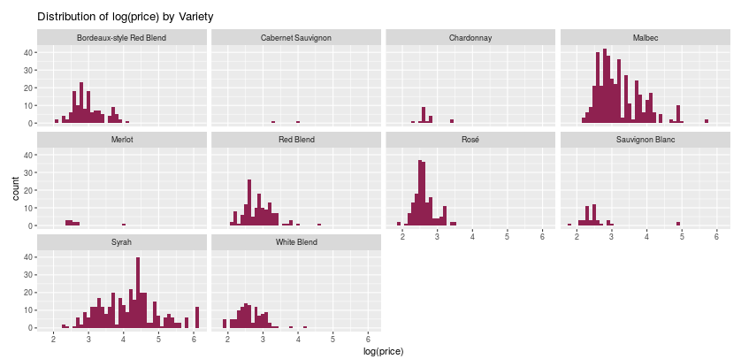

## Documentation

### 1. Sources

The original dataset is drawn from [here](https://www.kaggle.com/zynicide/wine-reviews/data) to create the shiny app.

The data wrangling process can be viewed from [here](Data_handling.R).

The image is from Ann Boyajian/Getty Images/Illustration Works.

### 2. Input

#### Country Select List

Currently, the user can use the Country select list to select and look at one of the following 10 countries:

* US          
* Italy       
* France      
* Spain       
* Chile       
* Argentina  
* Australia   
* Portugal    
* New Zealand 
* Austria
* Germany
* South Africa
* Greece
* Isarael
* Hungary

#### Province Select List

Currently, the user can use the province select box to select and look at the provinces in each selected country.

#### Histogram Colour

We set the path colour to be violetred(#8B2252) to make it more clear.

### 3. Output

The first plot is a density plot of wine price in the selected country and provinces.

The second plot is a scatterplot of wine price vs points. And the points are shown with different colours for different price groups.

The last plot is a faceted histograms of log(price) for different varieties.

